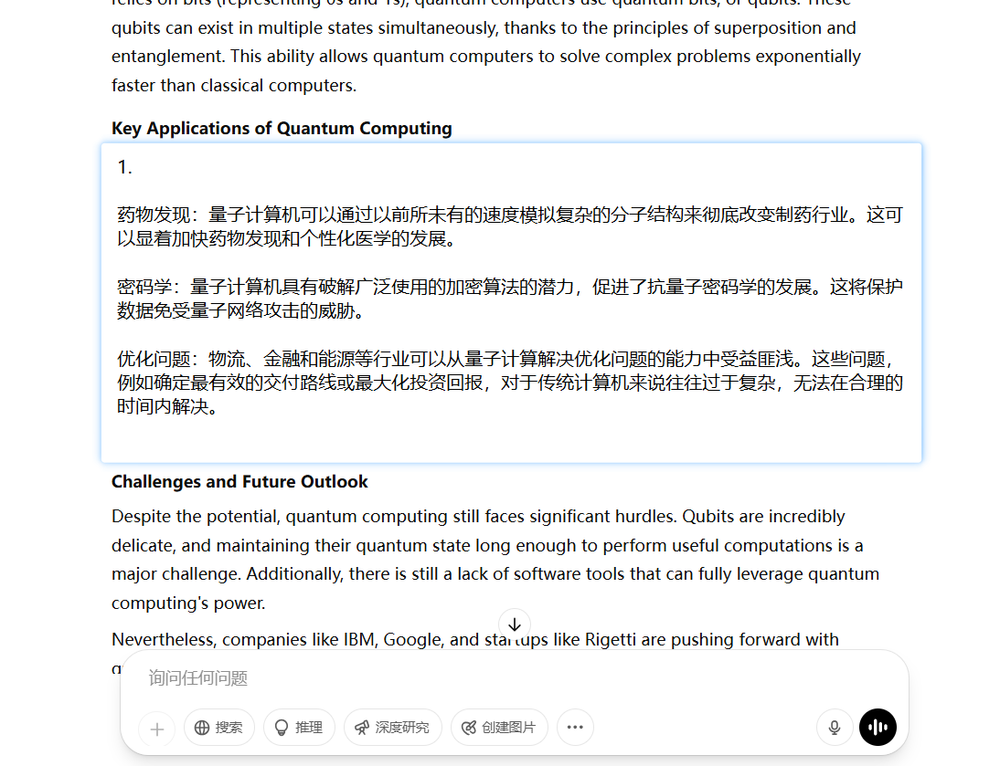
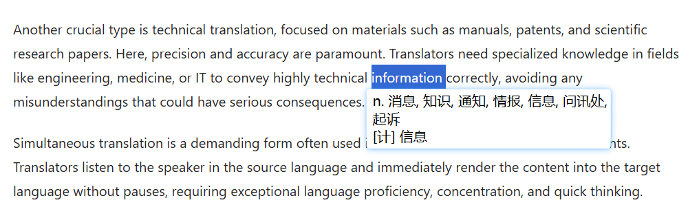

# LingZero

[](https://github.com/eee555/LingZero/releases)
[](https://opensource.org/licenses/MIT)

[](https://github.com/madmaze/pytesseract)
[](https://github.com/skywind3000/ECDICT)
[](https://github.com/argosopentech/argos-translate)
[](https://github.com/eee555/LingZero/wiki/Downloads-%E4%B8%8B%E8%BD%BD%E4%B8%8E%E5%AE%89%E8%A3%85)

> 离线翻译 & 截屏翻译 & 复制翻译，轻巧强大，作者自用！

由于市面上的翻译软件越做越烂，作者一怒之下开发出了自用的翻译软件——LingZero！

卡片式悬浮窗设计，可以任意拖动，点击窗口外部即可关闭。截屏翻译+离线翻译+复制翻译，真正做到极简、无感、丝滑流畅。左键点击即可对比原文和译文，右键复制文本。0切屏、0等待，保护心流状态，完全为英文文献阅读而设计！

## ✨ 核心功能

- 🚀 **开箱即用**：无需安装，也无需配置环境，直接运行。
- 🛸 **卡片式悬浮窗**：左键可以任意拖动，点击周围即可关闭，点击切换原文和译文。
- 📸 **截屏翻译**：快速截图识别 + 翻译（基于 [pytesseract](https://github.com/madmaze/pytesseract)）。
- 📋 **复制翻译**：复制即翻译，提升阅读效率。
- 💎 **词典翻译**：翻译单个词语（或短语）时，首选调用词典翻译，直接查询本地词典，包含690000个单词或短语（基于[ECDICT](https://github.com/skywind3000/ECDICT)）。
- 🧠 **离线翻译**：翻译段落或句子时，集成深度学习翻译引擎（基于 [Argos Translate](https://github.com/argosopentech/argos-translate)）。
- 🐧 **腾讯翻译**：翻译段落或句子时，假如联网，还能调用腾讯翻译（每月500万字免费，含标点），自动优化翻译结果。
- 💨 **中文改写英文**：选中一段可编辑的中文文本，按下快捷键，就可以直接将其改为英文，并且剪贴板同步修改。假如要用英文关键词搜索、回帖，非常方便。

\* *使用教程及快捷键配置见`config.ini`，如不习惯可自行修改*

## ✅ 推荐使用的场景或用户

- 希望阅读英文新闻，缩小语言问题带来的信息查。
- 需要阅读英文文献的科研人员等。
- 需要阅读技术文档的工程师、程序员等。
- 中文 ➝ 英文的一般质量翻译。
- 内网电脑使用的场景。

## ❌ 不推荐使用的场景或用户

- 中文 ➝ 英文的SCI写作级超高质量翻译（通常使用聊天机器人）。
- 英文 ➝ 非中文 翻译（本人只使用中文）。
- 排斥使用快捷键的用户，部分功能只能快捷键触发。
- 非Windows 10 / 11的操作系统。

## 👣 安装步骤

1. 从[发行版](https://github.com/eee555/LingZero/releases)下载最新版，解压后放到合适的位置。
2. 假如要使用腾讯翻译，打开"secret.ini"文件如下，前往[腾讯云官网](https://console.cloud.tencent.com/cam/capi)免费领取个人令牌，并填写在文件中。
```
[DEFAULT]
tencent_secret_id  = A*********************************ZO
tencent_secret_key = e******************************p
tencent_region = ap-shanghai
```

##  📈 效果展示

- 截屏翻译大段段落


- 词典翻译，详细解释单词的多种含义，复制或截屏均可启用


## 📦 TODO / 开发计划

- UI 优化，根据文档背景颜色，自动调整窗口背景颜色
- 接入百度、谷歌、阿里巴巴等翻译api

欢迎 Star ⭐、Fork 🍴 或提 Issue 🚀，一起打造更丝滑的离线翻译体验！
